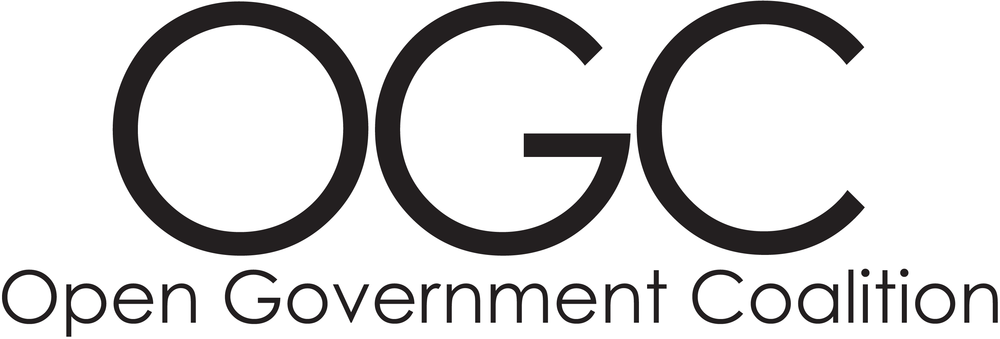

# Introduction

Welcome to the Open Government Coalition \(OGC\), a network of government agencies working on open source projects together.

## Mission Statement

_**Governments pooling technical talent to collaborate on projects with reproducible, impactful results, saving time and money.**_

## Summary

_**Governments + Open Source + Cloud + Funding** from key sponsors** = Useful Projects for All**_

---

## Features and Requirements {#requirements}

* _Code_/Programming: _open source_ and publicly developed
* Benefits _multiple_ governments at once
* Can be _easily_ deployed and is well _documented_
* Likely deployed to and integrated with existing city _cloud_ accounts
* May deal with sensitive data or data partnerships
* Pools our limited and specialized internal tech _resources_
* Saves _money_, quicker time-to-live
* No _RFPs_ needed - in house solutions
* Outside organizations can help develop/support/fund/promote/sponsor

---

## Project Portfolio

This is a **curated** list of well **documented** and **reproducible** projects, which improves their discoverability and fosters collaboration.

### 1\) Waze CCP Processor

Allows traffic teams and others within governments to store, analyze, visualize, and take action on Waze's CCP program data.

**Code**: [github.com/LouisvilleMetro/WazeCCPProcessor](https://github.com/LouisvilleMetro/WazeCCPProcessor)

_Collaborating Governments:_ Louisville, Denver, NYC, Joinville Brazil, \([see all 60+ govs](https://github.com/LouisvilleMetro/WazeCCPProcessor/wiki/Waze-CCP-Collaborative-Processor)\)

* _Sponsors_: Amazon AWS, Slingshot
* _Promoters_: Waze
* _Potential Future Collaborators_: Microsoft Azure, Google Cloud, Code for America
* _Constraints_: Must be a Waze CCP partner \(signed legal agreement with Waze\)

[**See Full Page Details**](waze-ccp-processor.md)

### 2\) SpeedUpYourCity

[Crowd sourced internet speed](http://www.govtech.com/Whats-the-ROI-on-Local-Broadband.html) tests that creates a public map and a open dataset.

**Example Implementation**: [speeduplouisville.com](https://www.speeduplouisville.com/)

**Example raw data and downloads**: [speedupsanjose.com/all-results](https://www.speedupsanjose.com/all-results)

**Code:** _Soon to be published once scrubbed and documented _

_Collaborating Cities:_ Louisville, San Jose

* _Sponsors_: TBD
* _Promoters_: TBD
* _Potential Future Collaborators_: NDIA, Mozilla
* _Constraints_: None

### 3\) Open Data Visualizer

Data viz platform for multiple open data portals, using APIs and CSV files for creating visuals, charts, maps for dashboards, embeds, KPIs.

**Code**: [github.com/timwis/vizwit](https://github.com/timwis/vizwit)

_Collaborating Cities:_ Philadelphia, Louisville

* _Sponsors_: TBD
* _Promoters_: TBD
* _Potential Future Collaborators_: CKAN, DKAN, Socrata, Open Data Soft
* _Constraints_: None

---

* [**Submit your own projects here**](https://github.com/GovInTheOpen/Project-Portfolio)

---

## Projects in Review

List of projects that are being reviewed to see if they can be included in OGC.

### - IFTTT for Cities

Automation services for citizens based off existing city APIs and open data.

**Code**: [github.com/LouisvilleMetro/IFTTT-Smart-Louisville](https://github.com/LouisvilleMetro/IFTTT-Smart-Louisville)

* _Collaborating Govs _\([Data Access Project](https://ifttt.com/blog/2017/06/introducing-the-data-access-project)\): Louisville, Tampa, Texas, Edmonton
* _Promoter_: IFTTT

### - SQUID - Road Quality through Camera Images

An open source data pipeline and analytics framework for assessing street quality. This approach utilizes the open source Open Street Cam to collect GPS, accelerometer and imagery data to be able to literally see the Ground Truth.

**Project Submission Page: **[OGC Discussion](https://github.com/GovInTheOpen/Project-Portfolio/issues/2)

**Code**: [github.com/streets-data-collaborative](https://github.com/streets-data-collaborative)

* _Collaborating Govs_: NYC
* _Promoter_: ARGO Labs

### - Zotero Metadata Translator

**Code**: [zotero.org/support/dev/translators](https://www.zotero.org/support/dev/translators)

---

* [**Read about how to start an OGC Project**](https://www.govintheopen.com/how-to-run-an-ogc-project.html)

---

## Similar Organizations

* [Harvard Civic Analytics Network](http://datasmart.ash.harvard.edu/news/article/civic-analytics-network-members-881) - Inspiration for OGC.  Many OGC collaborators come from CAN cities.  CAN has a much broader focus and just a few US cities are involved.  OGC should have more cities, states, countries and is focused on code projects.
* [Code for America](https://www.codeforamerica.org/) - Helped create the OGC by pushing for tech talent and skills inside of government with brigades and open source.  Many OGC participants came from CfA.  Big difference is that OGC may work on sensitive data or internal systems integrations that can't be made public, though CfA can still be part of the efforts.
* [Code.gov](https://code.gov/#/) - At the federal level, but it leverages the power of code sharing and collaboration to help the US Government cut down on duplicative software development and save millions of taxpayer dollars for the American people.

---

## Connect with OGC

* Github
  * [github.com/GovInTheOpen](https://github.com/GovInTheOpen)
* Slack Channel
  * [govintheopen.slack.com](https://govintheopen.slack.com)
* Twitter
  * [@GovInTheOpen](https://twitter.com/GovInTheOpen) 
* Website
  * [www.GovInTheOpen.com](https://www.govintheopen.com/)
* Organizer
  * Michael Schnuerle, Office of Civic Innovation, OPI, Mayor's Office, Louisville Metro, KY. 
  * Email michael.schnuerle at louisvilleky.gov. 
  * Twitter [@LouDataOfficer](https://twitter.com/LouDataOfficer)

#### More Stodgy Logo, If You Must

