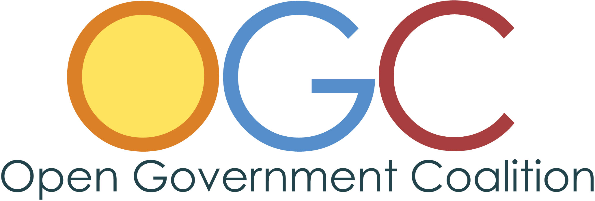
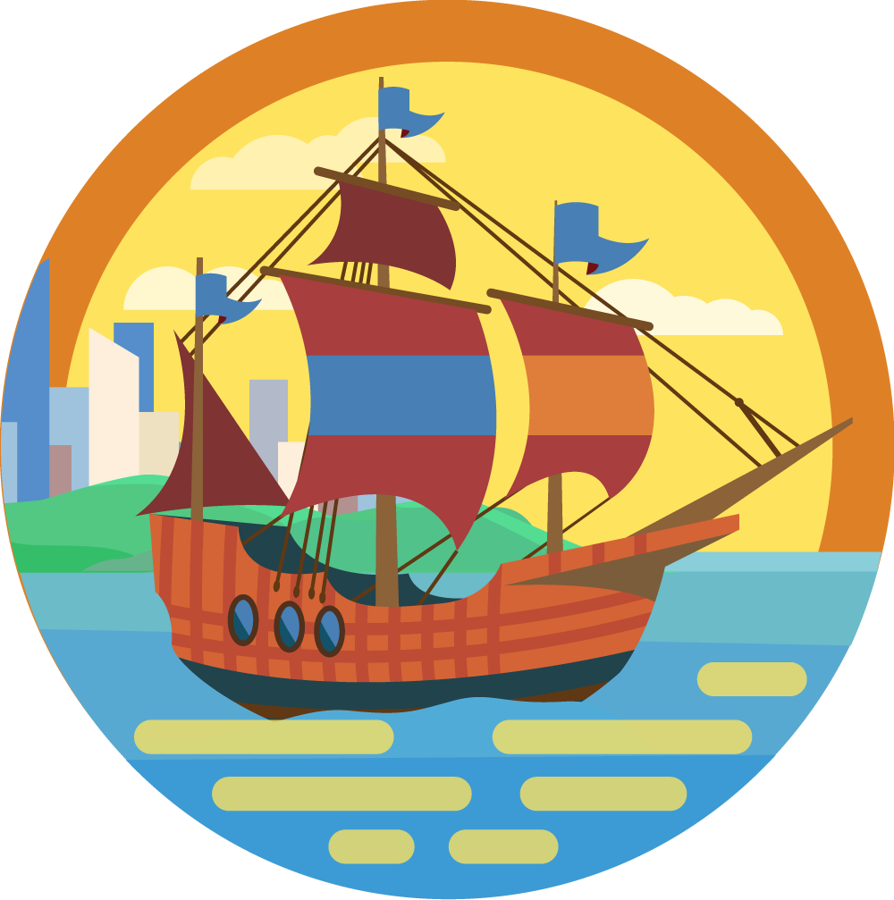

# Minutiae

This is just a collection on background information about the project. It may just be a boring way for you to see my thinking process. But in the spirit of open, here we go...

Thanks to Ed Blayney and the Innovation Office for the feedback.

## Name Background

Started as **Gov In The Open**, then this was part of the refinement process for the name. I wanted it to be something broad but descriptive, not taken, and with a fine acronym.

### Other Potential Names

1. City Actions
2. City Collaborative \(taken\)
3. City Alliance \(Alliance overused \[by me\], eg Civic Data Alliance?\)
4. Gov Alliance \(conference, [Smart eCity Gov Alliance](http://ieeexplore.ieee.org/document/7070097/?reload=true)?\) - City Gov Alliance
5. Open City Coalition
6. Coalition of Open Governments \(COG, Coalition for short\) \(too much like “coalition government?”\)
7. Open Cityship \(ship in the logo: travel, journey, destination, crew, many jobs, all hands on deck\)
8. Civic Open Coalition \(COC though...\)
9. Government Open Coalition \(GOC, Gov Open Coalition, GovOpCo, The Open Coalition\)
10. **Open Government Coalition **\(OGC, The Coalition\) - New winner!
11. Open Government Partnership \(ship analogy/logo since it has ship in it\) Previous winner... it's [kinda taken](https://www.google.com/search?q=open+government+partnership)
12. Municipal Open Partnership \(MOP, ship, MuniOpPa\)
13. Municipal Open Coalition \(The MOC\)
14. Civic Code Coalition \(Building the Smart City one line \(script\) at a time\)
15. Municipal Open Code Coalition…

### Keyword Pool

* Government, City, Municipal, Civil, Civic
* Open, Share
* Collaborative, Partnership, Alliance, Coalition, Cooperation, Friendship, Kinship, Fellowship, League, Support
* Results, Outcomes, Actions, Projects, Impactful
* Smart City, Open Source, deployable-code

### Logo

What, it's a sailboat in a sunset, how does that relate to city collaboration?? There is a city in the background... I wanted the logo to be friendly and accessible, not governmental. The name can communicate the purpose, but the logo should communicate the feeling. Something outdoors, that implied collaboration, a journey, and no government buildings! The boat implies we are working as a crew to get somewhere, each doing the parts that we can do.

**No**: Cloud, Gov Building, CodeData

**Yes**: Animals? \(squirrel?\), Nature, Outside, People, Mountain, Journey, Ship

**Ideas**: For ship: all hands on Deck, Mast, flag, masthead, sailing seas, forecastle, crew

#### Logo and Text Result

Here is what I came up working on it one night. It could be improved... I wanted a different kind of ship \(eg older with about 4 sails\), and had an idea to split the image in the logo into 3 parts/slices \(blueprint/sketch, black and white ink, and final color, eg, like we are building something\) but that proved to be too much.

Here are the** **[**source logo files**](https://www.dropbox.com/sh/deiu56ry1dphuh9/AACQtoiSL5PxmBzIxKXwbuPwa?dl=0)** **for anyone who has time to edit.

Originally I had a version where the sails were on backwards - the jib was over the stern and the boom over the bow for some reason \(Ed Blayney pointed that out\) - I fixed that in the current version, which has a larger boat too.

The OGC letters are custom made, inspired by Century Gothic \(which you see on the Open Government Coalition logo text on the home page\). Had a version where the O G and C overlapped each other with breaks and over/underpasses, but didn't have time to refine that idea enough.

Some parts of the vector artwork came from [Freepik](https://www.freepik.com).

